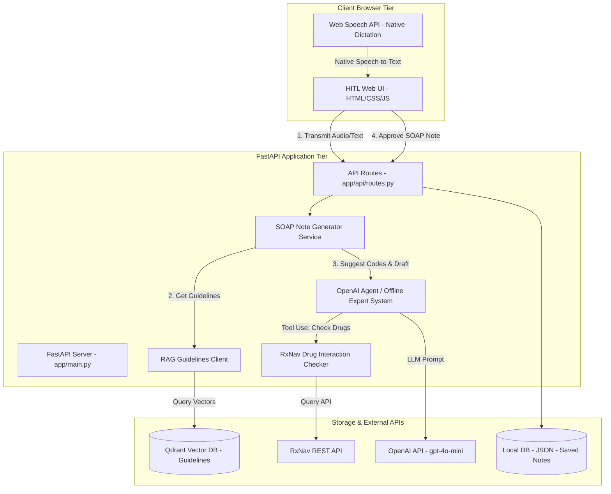

# MediMate Architecture Specification

This document details the software architecture, data pipelines, and security mechanisms of the **MediMate** clinical assistant.

---

## 🏗️ System Architecture (C4 Level 2 - Container Diagram)



---

## 🔄 Core Data Pipeline Flow

```
   ┌────────────────────────────────────────────────────────┐
   │ 1. User Encounters Patient (Speak Audio / Type Summary)│
   └───────────────────────────┬────────────────────────────┘
                               │
                               ▼
   ┌────────────────────────────────────────────────────────┐
   │ 2. Transcription Stage: Whisper API or Local Mock      │
   └───────────────────────────┬────────────────────────────┘
                               │
                               ▼
   ┌────────────────────────────────────────────────────────┐
   │ 3. RAG Retrieval Stage: Embed text and query guidelines│
   └───────────────────────────┬────────────────────────────┘
                               │
                               ▼
   ┌────────────────────────────────────────────────────────┐
   │ 4. Tool Execution: Check drug safety & ICD-10 suggestions│
   └───────────────────────────┬────────────────────────────┘
                               │
                               ▼
   ┌────────────────────────────────────────────────────────┐
   │ 5. LLM Synthesis Stage: Draft structured SOAP note     │
   └───────────────────────────┬────────────────────────────┘
                               │
                               ▼
   ┌────────────────────────────────────────────────────────┐
   │ 6. HITL Screen: Physician reviews, edits, and saves    │
   └───────────────────────────┬────────────────────────────┘
```

### 1. Ingestion Pipeline
Before the copilot is active, clinical guidelines from sources like NICE are converted to chunks, embedded using OpenAI's embedding API (`text-embedding-3-small` or hashed offline), and loaded into a Qdrant collection named `guidelines` (or cache file).

### 2. Retrieval Pipeline (RAG)
During an active session:
- The input transcript is embedded using the same vector representation.
- Qdrant (or local fallback) retrieves the top 3 most relevant clinical guideline passages.
- The retrieved guidelines are formatted as context and injected into the LLM system prompt.

### 3. Agentic Decisions & Tool Use
The agent leverages tool-use schemas:
- **`get_drug_interactions`**: Calls RxNav API to check safety profiles.
- **`get_icd10_codes`**: Formulates recommendations for ICD-10 coding.
- **`get_guideline_rag`**: Obtains context about medical rules.
- **`get_diagnostic_tests`**: Suggests standard tests.

### 4. Safety Guardrails
- **Refusal System**: If the clinical case is evaluated as an active high-acuity crisis (e.g. myocardial infarction or acute stroke), the generator triggers an out-of-scope flag. The FastAPI backend returns a safety warning payload, prompting the UI to render a warning banner directing the clinician to activate emergency transport.
- **Audit-ready Storage**: Finalized notes, including full edit diffs and doctor identifiers, are logged for compliance.
